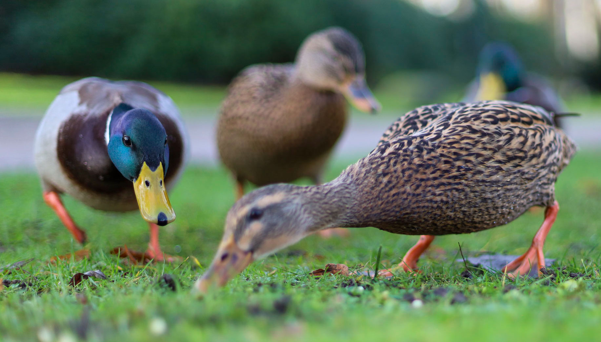
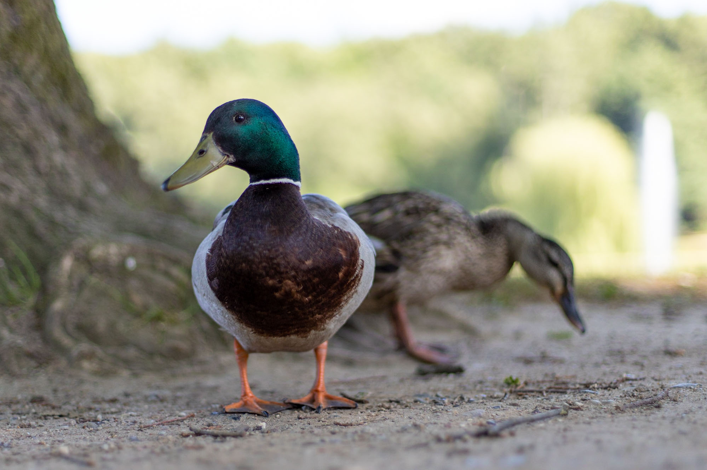
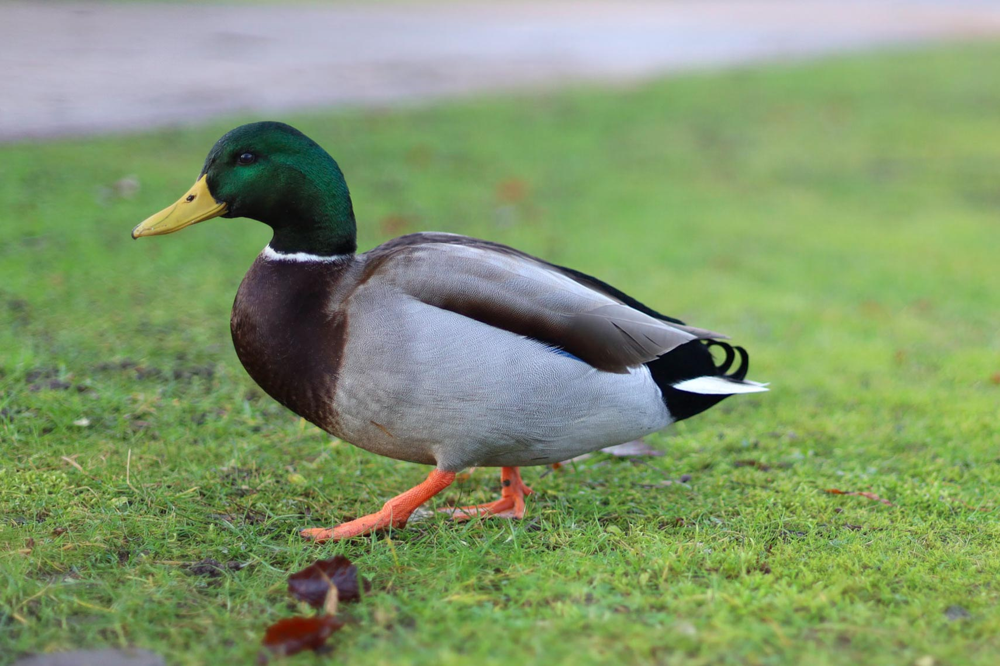
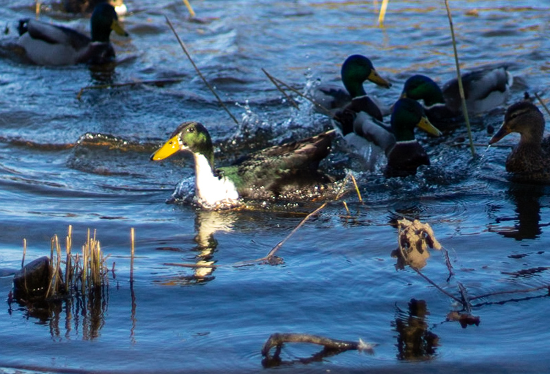





**Feeding wild birds - should you or shouldn't you?**

**Wild birds take care of their own. Just as with our lovely moorhen, the old feed the young, help them grow into strong adults so in time they are able to feed themselves, and, of course, their own offspring. This cycle repeats every generation, and in this way nature works harmoniously - bird feeding bird feeding bird...**

What kind of dinosaur descendant do you want to break bread with? Here I focus on waterfowl. In parks and cities there are numerous types of them, geese, ducks, swans, and others. There is a lot of controversy around giving them bread and other "human" food, and I want to shed some light on this. 

**To get this straight: In general, giving wild waterfowl something to eat can have negative consequences. But it is also a super cool activity.** As with everything, doing super fun things in moderation is key to not let them become stale like old bread.
So at first, let's look at some of the possible problems. Afterwards, I am going to go into what to do if you don't want to give up feeding burds and how to integrate yourself with nature without causing damage.

With that in mind, what are the possible negative consequences?

Wild birds are wild for a reason
-------------
They can take care of themselves. In nature, they find enough food to survive. In the process, they move about and keep their wits sharp. Imagine having to live of the land all your life, just eating what you find. Pretty impressive lifestyle, right? If people come and feed them, they can lay back and relax, waiting for the roasted pidgeons to fly in their mouths. As a consequence, they get what? Right, lazy. Just like us humans, when having nothing to do, birds can become bored. And what do humans do when they are bored? Right, they fight. And what else? Uhm, they breed. That in total can lead to too many birds, which can become a hygiene problem pretty quickly, too much poop in one place and parasites can spread. It has also been recorded that too many drakes aggressively try to mate with females when it is overcrowded, possibly drowning the poor duck in the process.
All things not so nice.

**The second problem centers around the water.** When throwing a lot of food into the water, it can lead to algae and bacterial growth, which depletes the oxygen levels of the water. This harms the fish and other creatures living under water. It is possible that botulinum toxine is created through putrefactive processes, which is a really dangerous nerve toxine and can kill birds (and humans, when consumed). 

**The third problem lies in the food itself.** Firstly, if the ducks don't gulp it down, the rats will. Then, imagine going to McDonalds every day, and additionally not doing sports as much as you used to! Giving waterfowl a lot of bread can lead to health problems. They tend to gobble down every scrape of food they find, and if there is a lot of dry mass in their throat, they can suffocate. And if the fast food is full of mold, forget about your health. Same for birds. 

Ahem, and in many places you can also get **a fine** when caught dealing out snacks for ducks. Be sure to know your local regulations!

All in all throwing too much food without differentiating into nature is not a good idea. 
But! I talked about moderation - what to do if we want to avoid those problems, yet still feed birds?

**Rule number 1:** Never feed moldy, rotten, or any other kind of putrid junk. Imagine having to eat that stuff! Don't feed what you wouldn't eat.

**Don't throw food into the water**, but throw it on the ground, and make sure there are no leftovers. Which leads to:

**Cater them with moderation**. Throwing whole bodies of bread after birds won't make them any happier. Give them a nice snack, not a five courses menu. Feed only what they can eat immediately. 

Maybe the most important: feed the right thing
-------------
 Bread is controversial - but actually, many farmers feed their lifestock grain. Bread is basically grains with some salt, and possible other additives like yeast. So it is not exactly pure poison for the birds. If you give them bread, give it in small portions, so that they can drink enough water to get it down and not suffocate because it swells in their throats. Especially the young ones need protein to grow. This is also a reason why you should never drown them in duck fast food.

 

**What is better than bread?**
Waterfowl, and especially ducks are used to soft, watery food, because they often grub underwater. If you want to feed grains, it is much better to use:
* oats 
* cooked maize grits 
* rice  
* leftovers from milling grains

Also good are: 
* snails 
* mealworms 
* chopped lettuce 
* birdseed or natural nut pieces 
* potato slices 
* defrosted frozen peas 
* small fruit like grapes 
* special duck food pellets

Make sure everything is bite-sized, because ducks or swans to not chew.  

**To sum it up: small portions, low volume, healthy ingredients make for a sucessful feeding trip without too many negative side effects. Be respectful of nature and your surroundings, don't litter and always keep your distance of breeding birds and possibly agressive ones like geese and swans.**

Enjoy your time in nature. And don't forget to bring a camera. Birds make for wonderful motives. Stay safe!





