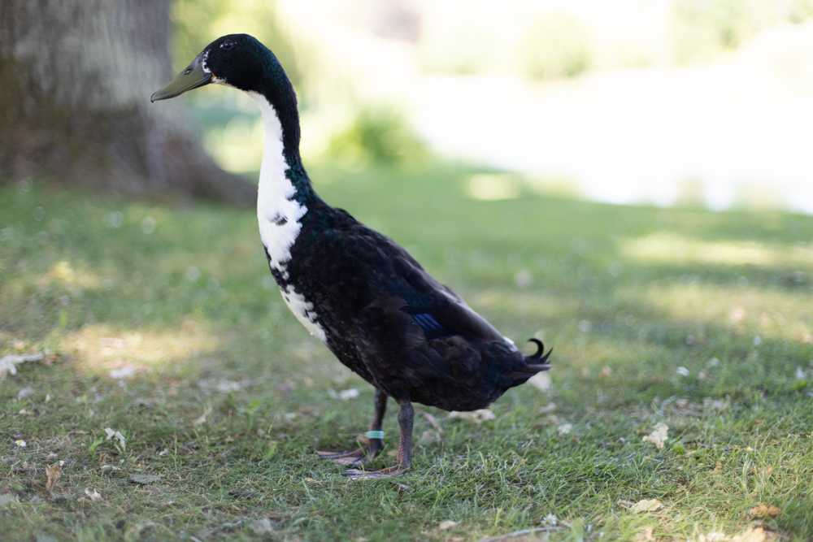
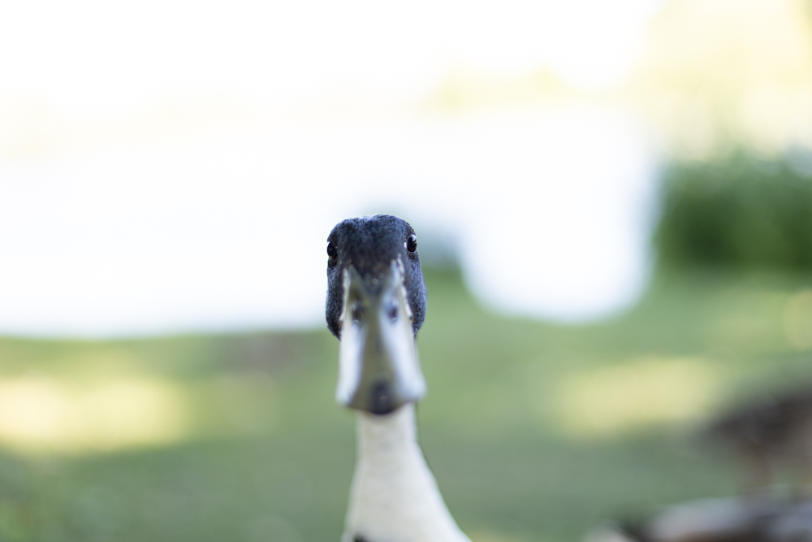
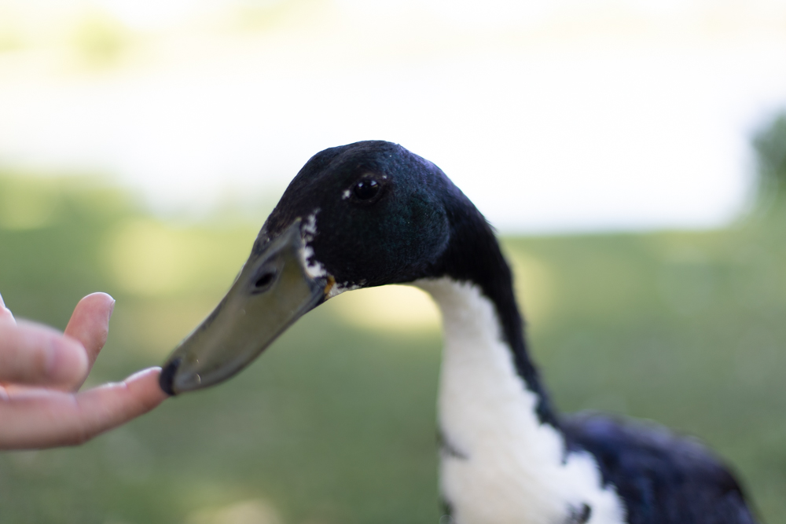

### In the long, icey cold winter of 2020...

...we met with a curious creature in our local park in Northern Germany. It just appeared at one time, and so far, it thankfully hasn't left. Paddling between the other ducks in the partly frozen water, the drake presented a beautiful bluish-green sheen on its black feathers, and it seemed just a bit bigger than its mallard companions. At first, we didn't pay much attention. Of course, it looked different with its slightly longer body, but not that much as to pique our interest. 

As usual, we brought some small gifts for our local winter birds. Of course, only as much as the water foul could eat and what is healthy for them, like a fresh handful of oats and some sunflower seeds. 
Some weeks went by, and the duck, which was also decorated with a nice white marking across its chest, continued to show up at the small lake and swam around with the others. Nothing unusual so far, the birds did their bird thing and we humans gladly helped them endure the cold with slightly more comfort in their bellies. 

But one partly cloudy day, and it was already a bit warmer by then, we saw something peculiar on the other side of the small river that flows through the area. It really made an impression on us:



<iframe src='https://www.xeno-canto.org/646375/embed' scrolling='no' frameborder='0' width='340' height='220'></iframe>



The black drake emerged from the water. And it looked so different from any other duck we'd ever seen before at our park pond, that we just couldn't help but stare in awe and fascination. At first, it walked slightly hunched forward, just like a regular duck but already more upright. But then, it gained more confidence and stood straight up, walking just like a human would if he had bird shape, with its long neck stretched up, its olive green beak pointed forward, a bottle-shaped body perched atop two dark orange duck legs. What a sight it was! Especially compared to the other ducks surrounding it.

We never before had laid eyes on an indian runner duck before, or if we had, not very consciously and not in real life. We figured that this bird might have escaped from a private owner, because even though it had a ring, it was only a simple one, without any ornithological markings. 

But at that moment, we fell in love with it. We spent many hours of our free time to visit the lake and looked especially for the Long Duck, which was now officially its name.

Sometimes "he" was there, sometimes he wasn't. At first, the Long Duck kept his distance. Also, he seemed to be at the bottom of the duck hierarchy, because the others used every opportunity to bite his backside and chase him across the lawn. Which made one of his main talents apparent: running. He could only flutter and bridge tiny distances with his rather short wings, but he could run. While we were attempting to whoo him and his companions with some treats, he'd get so nervous that he stumbled over his own feet just trying to escape the bills of the more agressive mallards. They really didn't give him a break. And instead of fighting back, he just ran! It was nonetheless a very funny sight. He seemed to be in good health and we were positive that he would learn. Sometimes we made some hand movements resembling an open beak in the direction of the others, making them retreat a bit, to show him what he could do to defend himself.

Another nick name of our feathery friend was coined at that time: "Lone Duck". Runner ducks are normally very social birds and, if kept at home or on a farm, should never be without some friends: best to keep only drakes, or more ducks than drakes, because otherwise the drakes will make life difficult for the females by fighting to mate with them.
But here he was, an outsider because of his different appearance and larger size, often seen swimming without companionship. And if he approached the others, they would chase him away. So of course we tried our best to make his life a little better.

He never fed from our hands directly, though. Always being cautious. Of course, ducks are prey for many other wild animals, like fox, badgers and birds of prey. They need to watch their rumps! But we weren't giving up. Each visit we brought some small presents, and each time he came a bit closer. 

This went on for some months, the weather got warmer, and we continued to visit this spcial bird. And after some time, we noticed something interesting: he seemed to climb the ranks of the local duck hierarchy! At first, we noticed that he sometimes asserted himself against the other ducks, chasing them a few meters, instead of the other way around. We were astonished! This had not happened before. Mostly he was the one running, though. But it was a start!

Other changes appeared, as well: he seemed to gather a following. At first, it was only one other mallard seen swimming with him. To tell mallards apart is very hard, so we couldn't say for sure, but we think it might had been the same each time. Then, more ducks followed. His group grew. We might be, in part, responsible: If you are with the Long Duck, you get food. Simple rule, and every smart bird will pick up on it.

So that was a good development. We learned other things, too: the runner duck drake makes a very peculiar rasping sound, a rather quite one, not so much a loud quack like the females supposedly do, but a softer, more bassy sound, that seems to come more from the back of the throat. When he is toddling towards and around us, it can be often heard and he seems to enjoy communicating in this way. We love to imitate it and confirm his statements, hopefully to his satisfaction.

If he isn't very busy with rooting on the lake or spending serious bird-only time with his gang, we can also get his attention this way. Usually, if he chills on the meadow near the lake or is causally paddling around, he won't pay much attention to humans, except maybe to confirm that they don't bring dogs too closely, of which waterfoul does absolutely not approve. But, having picked up some "Duckish", we learned to call out in his direction. One second, he is just dozing in the sun, the next, wide awake, head is going up, the bird jumps to his feet and waddles towards us, constantly rasp-rasping. Instant mood bonus for us humans guaranteed, every time.

One of the best things, though, has only happened for a little while now. With careful attention and patience, we managed to to respectfully gain the trust of the Long Duck, to lure him closer bit by bit each time we visit. We always try to squat down to his eye level, so that he doesn't feel intimidated by the big Long Humans. Maybe he also approves of the fact that we always took his side while the other ducks gave him a hard time in the beginning. They still sometimes tackle him, but so does he in turn. We also observed that this casual fighting, teasing and rump snapping happens all the time around mallards, it's just their way of life. In every social group tensions need to be handled and resolved, and this is the way of the ducks. 

But, to finish the point I was making: after a long period of getting to know each other, he now feeds from our hands. This is just one of the things that brightens our day each and every time like a happy pill. After sounding the signal, "wuak-wuak", in his direction, he and his group approaches, and he waddles towards us. We first have to throw a little bit of oats onto the ground, to initialize the feeding. Then, we can put a bit onto our hands and stretch them out, and he will come and eat from them. Other ducks sometimes follow his example, but only with him it is a fixed ritual by now, and one that is reliably happening when we meet.

---

> Feeding wild birds is a controversial topic. Many established organizations in the field of bird protection argue for no positive effect on seasonal survivability. Only non-endangered species are main benefactors of human provided food. [Source](https://www.nabu.de/tiere-und-pflanzen/voegel/helfen/06331.html). The opposite position view bird feeding as a moral obligation and replacement of lost natural food sources through human influence through intensive farming. [Source](https://www.amazon.de/-/en/Peter-Berthold/dp/3440156931)

---

This behaviour, of course, fits the theory that he escaped, or was released, from a human owner. After some initial getting to know, he is now much more comfortable in our presence, and also runs around us and in general just behaves like a happy duck.
Of course, we are not under the illusion that he is monogamous towards us. Sometimes we see other people interacting with him, and he stands up straight just as well and looks expectantly. If they feed him, he eats. But we never saw him feed from anyones hands...

Of course, he is, at least in part, a wild bird and they need be opportunistic and eat whatever is available. Also, they won't stop eating and can get sick or hurt, so we always make sure not to bring a whole lot, and that is in general a good idea when feeding wild animals. Especially in a nice park, birds will do fine on their own, and do not need a giant pile of extra food from us. We see it as a nice snack that we offer them, but not a five course menu.

So, to sum it up, this Long Bird has been a constant source of joy whenever we visited him. His peculiar figure and sound, as well as watching him interact with us and the other birds, is just so special and fun. We hope that he will be around for a bit longer, as long ducks, excuse me, Indian Runner ducks, can reach up to 20 years, even though usually it is more like 12-15.

